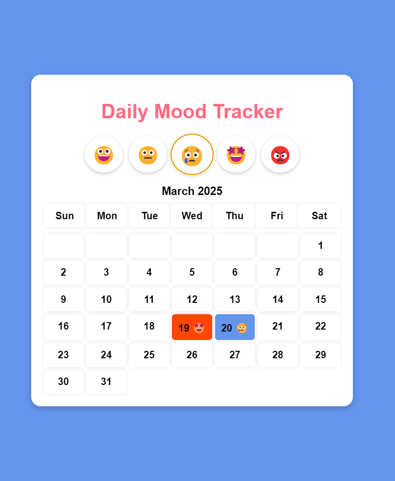

<<<<<<< HEAD
Mood Tracker
A simple web application to log and visualize daily moods using emojis. Moods are stored locally and displayed in a monthly calendar view.

📌 Features
✅ Select a mood (😀, 😐, 😢, 🤩, 😡) for each day
✅ Moods are saved in LocalStorage for persistence
✅ Background color changes based on the selected mood
✅ Monthly calendar view displaying recorded moods
✅ Responsive design for mobile & desktop

🚀 Live Demo
🔗 View the live application

🛠️ Technologies Used
HTML – Structure the webpage
CSS – Styling for a clean UI
JavaScript – LocalStorage handling & dynamic calendar generation

📷 Screenshots

📂 Installation & Setup
1️⃣ Clone the repository:

sh
Copy
Edit
git clone https://github.com/your-username/mood-tracker.git
2️⃣ Open index.html in a browser

📤 Deployment
This project is deployed using GitHub Pages.
To deploy, push your changes to GitHub and enable GitHub Pages under repository settings.
=======
# Mood-Tracker
>>>>>>> 4a60c50023ebb55239f47d7fac3f5912b47609ea
